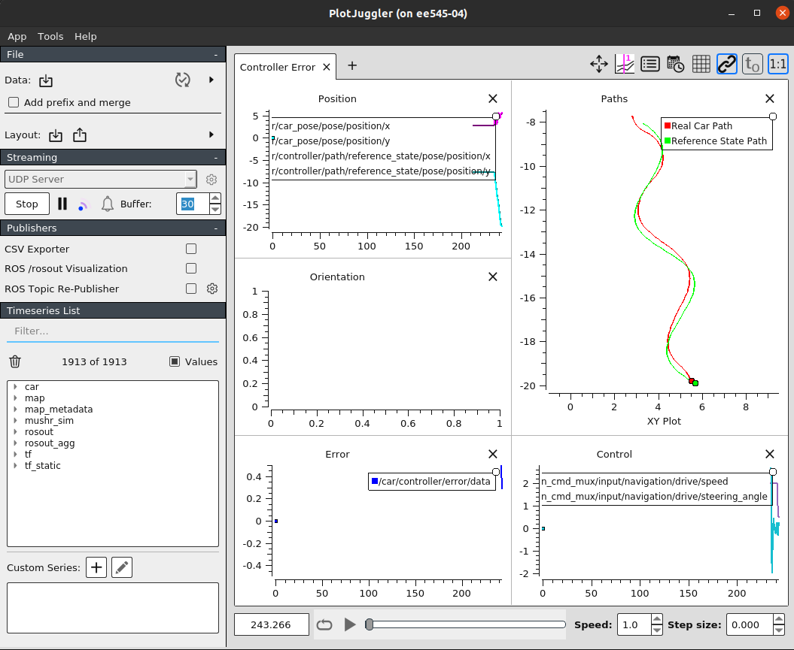
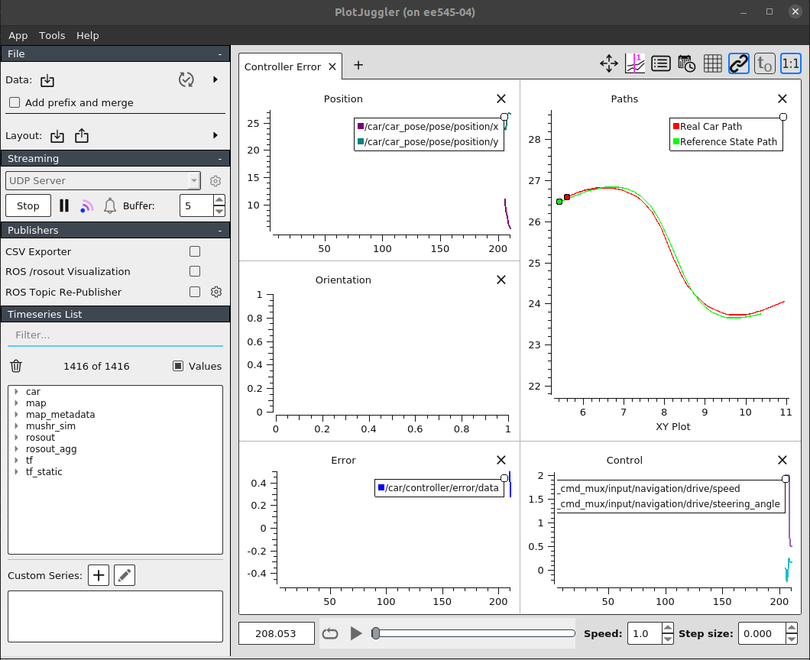

# Project 3: Control 

## Questions
### Q1: What tradeoffs did varying the Kp gain have on your PD controller’s performance?

When we use a higher Kp, it will result in a faster response and a stronger control. But if the Kp is too high, it will lead to instability or overshoot. When we use a lower Kp, it will result in a slower response and a weaker control with larger steady-state error. But it may improve stability and laed to less overshoot. As a result, we need to find a suitable Kp which is not too high, and find a balance of response speed, stability and overshoot.

### Q2: Describe the tuning process for your PD controller. Justify your final gains Kp,Kd and include the controller plots for three reference paths on the default sandbox map (pid_circle.png, pid_left.png, pid_wave.png).

Firstly, we tune the kp higher from 0.5, since a higher kp may make the system response faster to errors and get a stronger control. However, when the kp is too big, it become unstable and oscillation, so we try to make kp higher but not too high. Then, we start to tune the kd, we found that when kd become higher, the system will be more stablen and may use less time to become stable. But when the kd become higher and higher, it lead to too much noise amplification. As a result, we find a kd which can not only balance the oscillation but also guarantee the stable and fast response of the system.

·   pid:

           kp: 2.5

           kd: 1.8

  
#### circle

#### left

#### wave

### Q3: Describe the lookahead distance tuning process for your Pure Pursuit controller. Justify your final lookahead distance by including the controller plot for the wave reference path on the default sandbox map (pp_wave.png).

The lookhead distance in the Pure Pursuit controller was tuned incrementally, starting with a default value (0.5) and increasing in steps of 0.1. Testing on the wave reference path revealed that smaller values caused instability, while larget values led to delayed response in tight curves. The final value of 0.98 was chosen as it provided the best balance between smoothness, stability, and accuracy.

The real car path closely follows the reference path with low position error observed in the plot. Steering and speed show gradual adjustments, avoiding oscillations.

### Q4: Include controller plots on the wave path for cases where the lookahead distance is too small/large (pp_small.png, pp_large.png). Explain the resulting Pure Pursuit behavior.

#### Lookahead distance = 0.01

Behavior with large lookahead distance:
The car attempts to follow the reference state path very closely, resulting in sharp turns and oscillations, particularly at curves, as it exhibits overcorrection, as seen in the frequent deviations from the reference path. A small lookahead distance makes the controller overly reactive to minor deviations in the path, which results in the car quickly trying to realign to the path, further results in frequent overreactions. 

#### Lookahead distance = 5

#### Behavior with large lookahead distance:
The car diverges significantly from the reference path, especially in sections with high curvature. The car cuts corners and fails to align properly in sharp turns. A large lookahead distance causes the controller to prioritize smoothness over responsiveness. The car aims for a target point far ahead, which reduces oscillations and abrupt corrections, and compromises tracking accuracy.
### Q5: How does varying the radius of the circle path affect the robustness of the Pure Pursuit controller?

A smaller radius of the circle path will make the Pure Pursuit controller less stable. It needs an increased steering command and may cause instability or oscillations, so the robustness will be weaker. A bigger radius of the circle path will make the PP controller more stable. It will have a more smoother steering command so the robustness will be better. But when it comes to a bigger radius, it may also have some problem if we need to make a emergency curves, since it may cause inaccuracy of path tracking. So we need to balance this things and find a radius with good robustness.

### Q6: Describe the tuning process for the MPC optimization parameters. Justify your final parameters K, T by including the controller plots for the circle, wave, and saw reference paths on the default sandbox map. What makes the ]codesaw path so difficult to track?

The MPC parameters were tuned from initial values K = 2, T = 1 to final values K = 16, T = 12 to improve track on the circle, and saw paths.
We gradually increased K (prediction horizon) and T (control horizon) while testing performance on each reference path. Larger K improved prediction accuracy by allowing the controller to consider a longer time horizon, larger T improved control smoothness by extending the control optimization period.

During the process, we observed the real path alignment with the reference path, and analyzed abrupt changes in control inputs (steering and speed), finally we checked the plots for deviations. 

For circle path, the car followed the circular path smoothly with minimal deviation, showing that the parameters are effective for consistent curves. 
#### circle

For the wave path, improved alignment on the wave path indicated that the controller could handle moderate variations in curvature.  
#### wave

For the saw path, the sharp transitions in the saw path make it difficult for the controller to predict and react quickly, the sharp angles introduce nonlinearity, which is harder to optimize over shorter horizons, which requires balancing K and T to avoid excessive computation time while maintaining accuracy. The turning radius is also too large for the car to make a turn. As shown in the plot, the car stucks in a infinite loop trying to reach the destination.
#### saw

### Q7: Include controller plots for two reference paths and slaloms of your choice in the slalom world map.

### Q8: In this project, we asked you to implement a very specific MPC cost function that only includes distance and collision terms (and specific weights for the two terms). What other terms might you include, if you were to customize your cost function? (You don’t have to implement this, just describe some ideas.)

1. Control Inputs: the steering angles, acceleration will affect the controll and maneuver of the car.
2. Path curvature: a very tight curve will make the car more unstable.
3. Running Speed: make sure the system states is in a range of speed limit or something, to make the car more smoother to run.
5. Obstacle Avoidance: if the car approach closer to an obstacle, it will cost more to change its states.

### Q9: Of your three tuned controllers, in which settings is each controller most robust? Which controller worked best in high-speed regimes? You can set the desired speed by adding the --speed <SPEED> flag to path sender.

PID controller is more robust when there are no significant changes in the conditions and the parameters are tuned properly. PP controller is more robust when the system dynamics are lowly variable or uncertain and with small external disturbances. MPC controller is still robust when there are significant changes or uncertainties in the system because MPC can predict future states and minimize cost while satisfying constraints.    

When there are no significant changes or disturbances in the conditions, PID will work best because it is simpler and faster than MPC. MPC needs more computational demands than PID. And PID is robust with small disturbances. But if there are significant uncertainties in the system, MPC will work best in high speed regimes, because MPC can predict future states and minimize cost in advance which helps it deal with rapid changes at high speed.

### Q10: Record a video of your particle filter running successfully on the real robot. You should use the small basement map, and the video should show your robot moving via teleoperation around the basement. Any reasonable submission for this question will be accepted, as long as we can reasonably see the localization capabilities of your system.

https://drive.google.com/drive/folders/176pFVYAMRGTDG6YIAG4VJPipAQByTFog?usp=drive_link

### Q11: Record a video and a screenshot of rviz for each controller (pid, pp and mpc) running on the real car. See above for the detailed instructions.

https://drive.google.com/drive/folders/15Spy0q-GwVUnidww9qZiAc1bBuH232Yh?usp=drive_link
