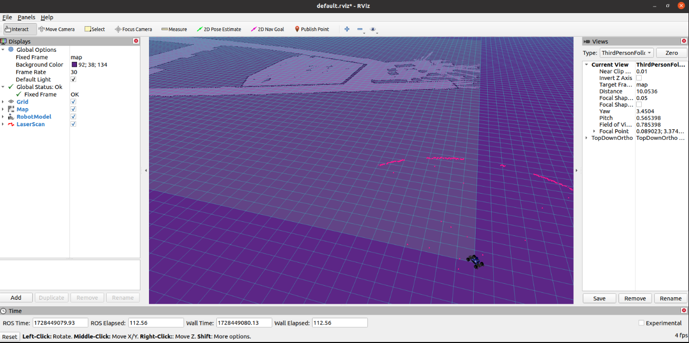
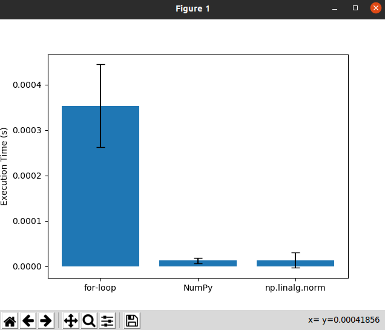
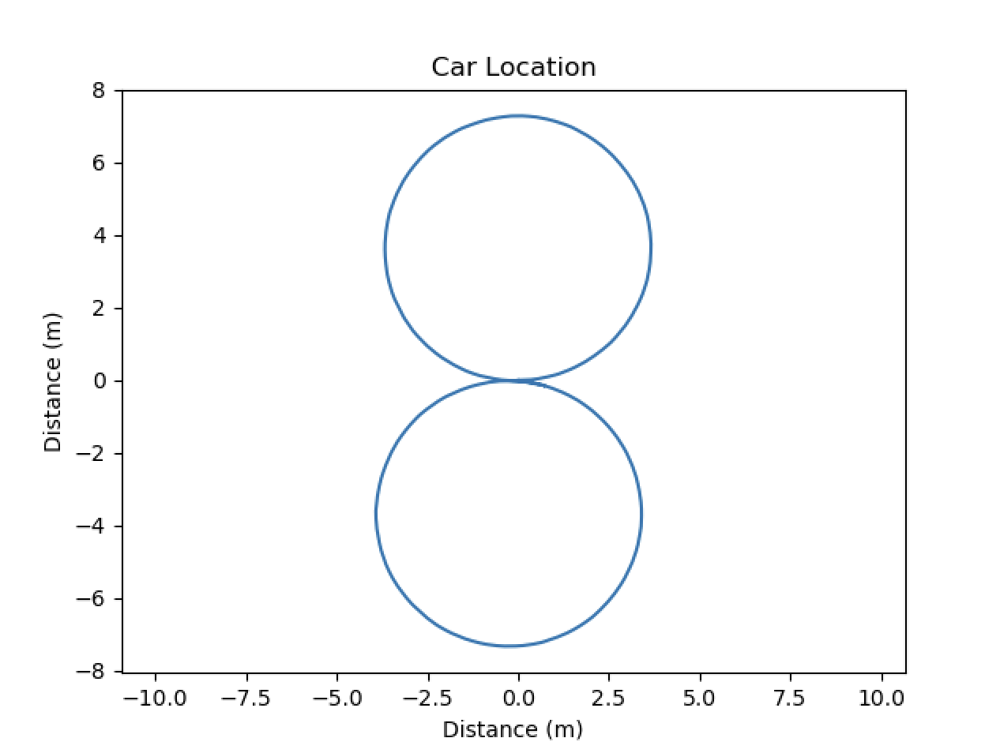
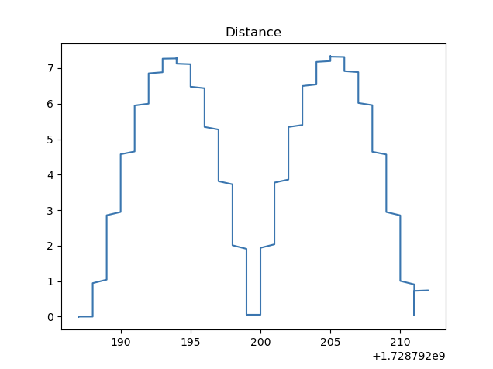
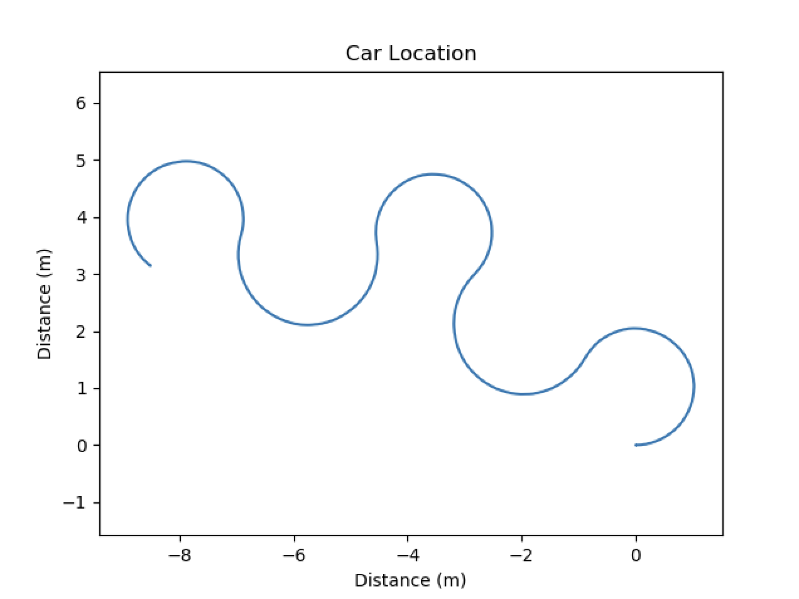
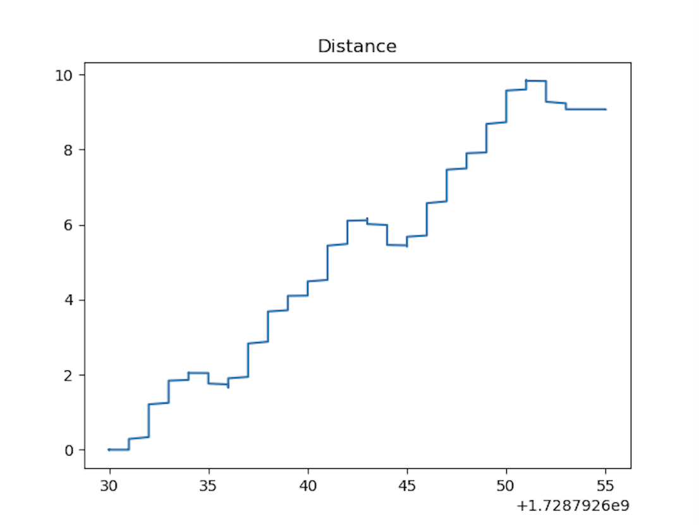

# Project 1: Introduction 

## Questions
# Q1: Define in your own words what a node, topic, publisher, and subscriber are and how they relate to each other.
 
Node - A Node is an executable file for a single purpose that can be compiled, executed and managed independently and can communicate with other nodes.
 
Topic - A Topic is a name for a stream of messages through which nodes can exchange messages.
 
Publisher - A Publisher is a node that sends messages to a topic.
 
Subscriber - A Subscriber is a node that receives messages from a topic.
 
Relationship
·   Nodes communicate over topics and can publish or subscribe to a topic.
·   Nodes can act as publishers or subscribers.
·   Publishers send messages to a topic, and subscribers receive messages from the same topic.
 
 
# Q2: What is the purpose of a launch file?

A launch file is a tool for launching multiple nodes and setting parameters.

# Q3: Include the RViz screenshot showing the new map.

# Q4: Include your runtime comparison.png figure for the different norm implementations.

 

# Q5: Include the locations.png and distances.png figures for the plan figure 8.txt.

# Q6: Include the locations.png and distances.png figures for the plan tight figure 8.txt.

