# Project 2: Localization 

## Questions
### Q1: In the motion model plot, why are there more particles within a 10cm radius of the noise-free model prediction in Figure 2 than Figure 3?

Firstly, the velocity of Figure 3 is higher than Figure 2. Higher speed usually causes higher uncertainty, so the particles will expand more at a higher velocity. Secondly, the steering angle of Figure 3 is sharper than Figure 2. A sharper steering angle also causes more uncertainty and particles will also deviate more sharply. The duration of Figure 3 is longer than Figure 2, so the particles will have more time to spread out. All these factors including higher velocity, sharper steering angle, and longer duration will generate more particles with different locations.

 
### Q2: Include mm1.png, mm2.png, and mm3.png, your three intermediate motion model plots for control (v, δ, dt) = (3.0, 0.4, 0.5). Use them to explain your motion model parameter tuning process. For each plot, explain how it differs from Figure 3, and how you changed the parameters in response to those differences. The last plot should reflect your final tuned parameters.

Motion Model Parameters:

·   Plot 0 = motion_params:

           vel_std:    0.05

           delta_std:  0.5

           x_std:      0.05

           y_std:      0.05

           theta_std:  0.05
           

·   Plot 1 = motion_params:

           vel_std:    0.01

           delta_std:  0.1

           x_std:      0.01

           y_std:      0.01

           theta_std:  0.01

·   Plot 2 = motion_params:

           vel_std:    0.01

           delta_std:  0.1

           x_std:      0.01

           y_std:      0.005

           theta_std:  0.01

·   Plot 3 = motion_params:

           vel_std:    0.01

           delta_std:  0.1

           x_std:      0.01

           y_std:      0.008

           theta_std:  0.01

First off, here is the plot with the TA provided parameters. It is more spread out than the required plot. So we lowered all the parameters first.

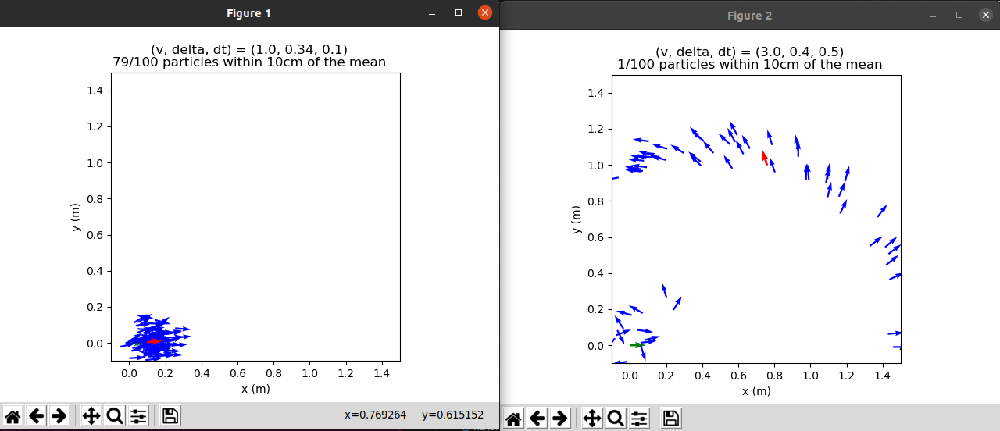

We can see that the distribution of states by the noise-free model is much tighter. 

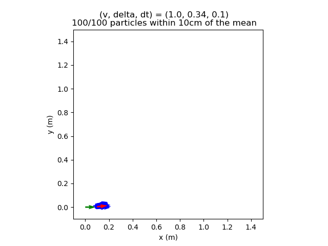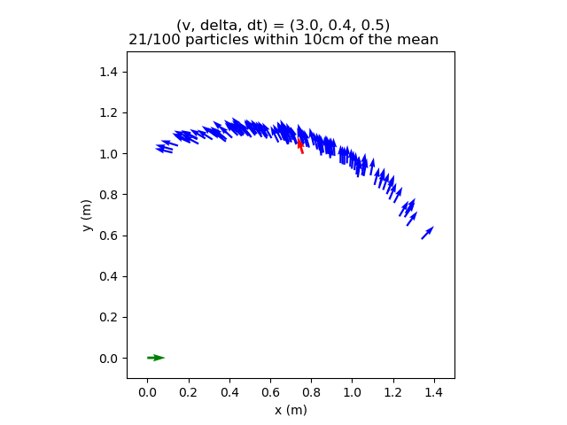

After lowering the parameters, we still thought the range of the y coordinate of the particles was wider than in Figure 3. So we tried lowering the y_std parameter to tighten our y-axis plot.

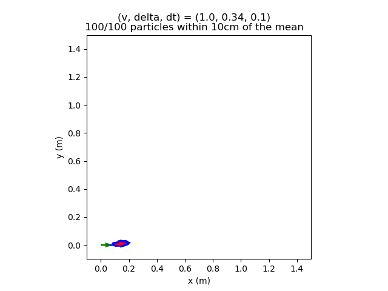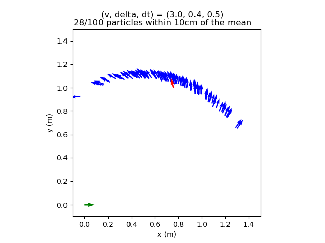

Lastly, we thought the range of the y coordinate of the particles was tighter than in Figure 3. So we tried increasing the y_std parameter again. With our final tuned parameters, we were then able to generate a plot similar to Figure 3.

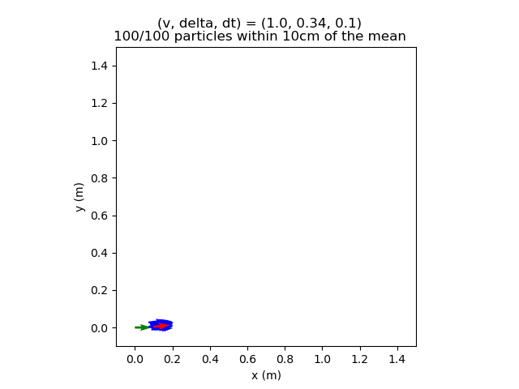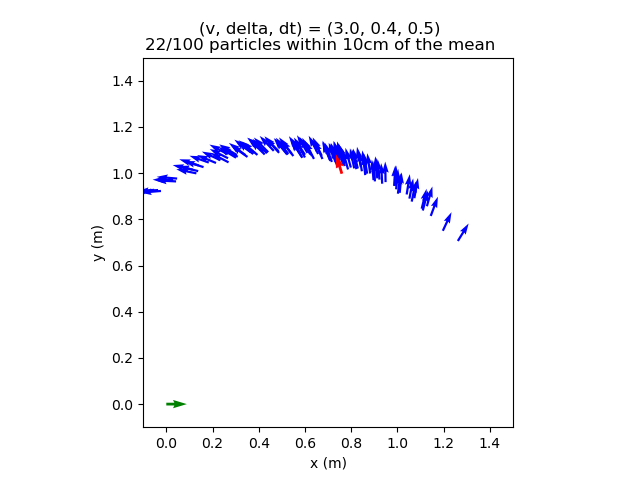

### Q3: What are the drawbacks of the sensor model’s conditional independence assumption? How does this implementation mitigate those drawbacks? (Hint: we discussed this in class, but you can look at LaserScanSensorModelROS for the details.)

The conditional independence assumption between the laser beams is sometimes not right. It may have reflectivity of surfaces and laser beams are side by side to get messed up in the same way. What’s more, there may be calibration errors that make neighboring observations dependent on each other. 
The implementation downsamples the laser measurements to mitigate those drawbacks. It can help us get things that are not exactly next to each other or correlated with each other. So this method can make it less susceptible to correlated noise.

### Q4: Include sm1.png, sm2.png, and sm3.png, your three intermediate conditional probability plots. Document the sensor model parameters for each plot and explain the visual differences between them.

Sensor Model Parameters:

·   Plot 0 = sensor_params:

            hit_std:    1.0

            z_hit:      0.5

            z_short:    0.05

            z_max:      0.05

            z_rand:     0.5
            

·   Plot 1 = sensor_params:

            hit_std:    0.7

            z_hit:      0.6

            z_short:    0.05

            z_max:      0.05

            z_rand:     0.5

·   Plot 2 = sensor_params:

            hit_std:    0.7

            z_hit:      0.6

            z_short:    0.02

            z_max:      0.02

            z_rand:     0.2

·   Plot 3 = sensor_params:

            hit_std:    0.7

            z_hit:      0.6

            z_short:    0.02

            z_max:      0.01

            z_rand:     0.1

         
Firstly, here is the plot with the TA provided paramters

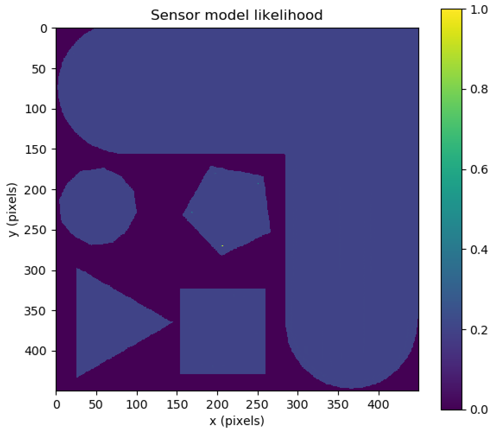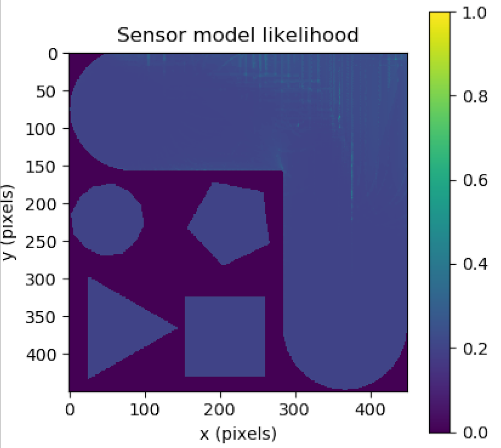

Starting from plot 1, we can see that compared to the initial parametes, when we tried tuning hit_std and z_hit values, the plot @(9, 9, 0) becomes more centralized distribution of points and the plot @(4.25, 5.50, 0) has little change.

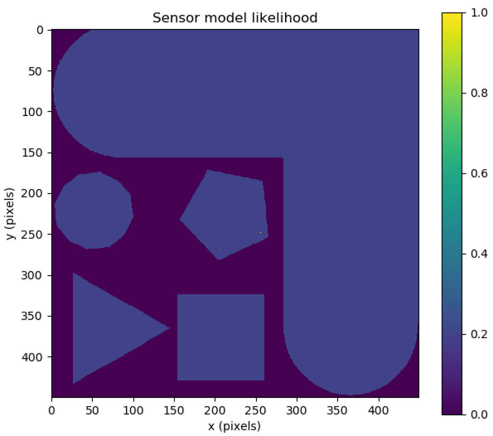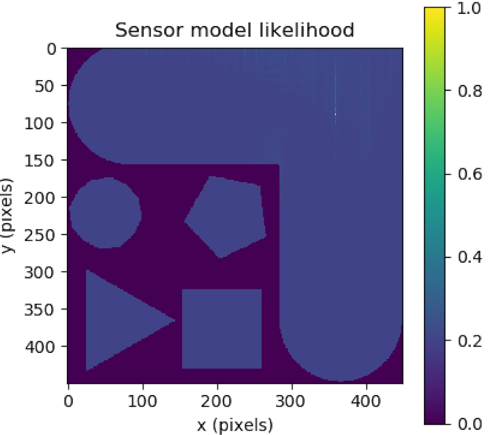

We then tuned the parameters by modifying the z_short, z_max and z_rand values to see what kind of plot would be producded for plot 2. In plot 2, we can see that the distribution of points @(9, 9, 0) becomes much tighter.

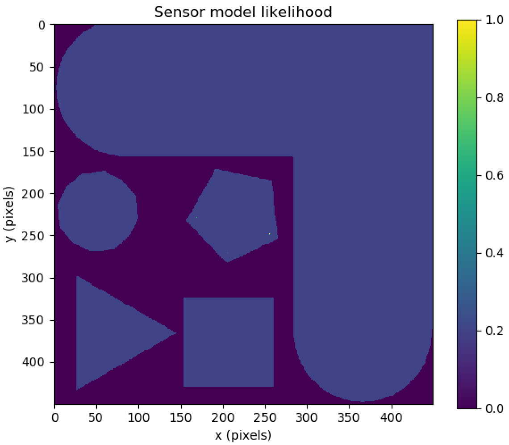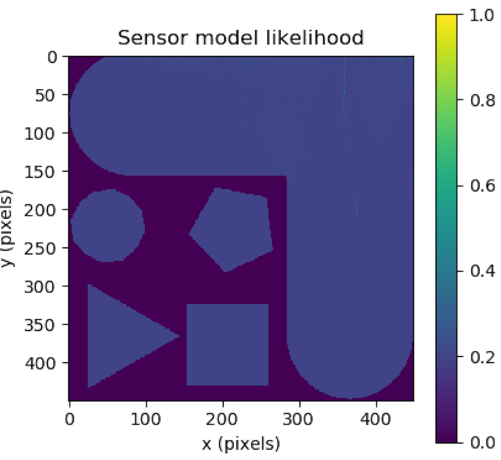

Lastly, for plot 3, we tried tuning the z_max and z_rand to tighten our plot @(9, 9, 0) and make the points clearer @(4.25, 5.50, 0) plot. With our final tuned parameters, we were then able to generate plots similar to Figure 4 and Figure 5.

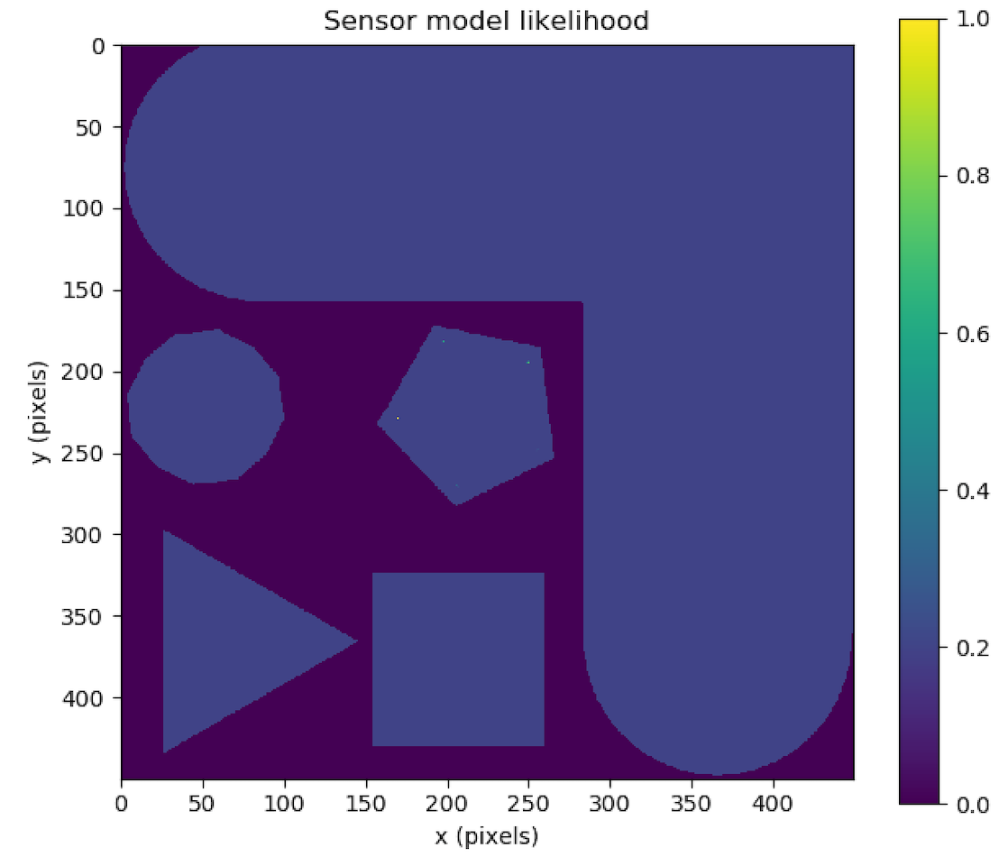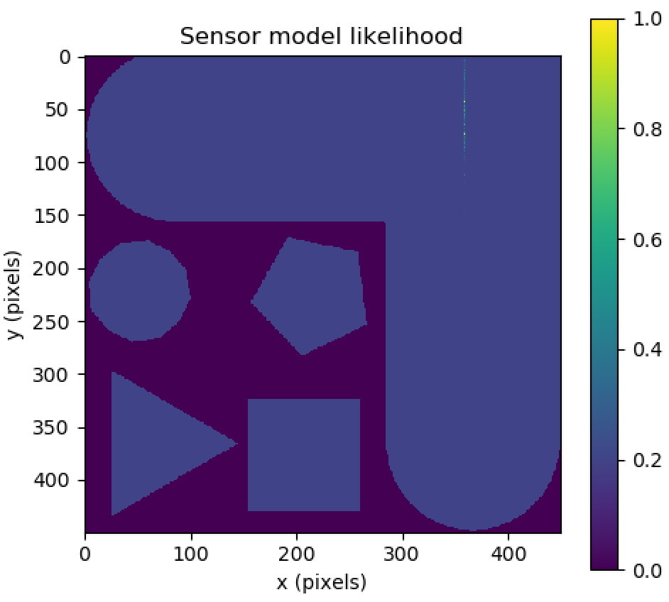

### Q5: Include your tuned sensor model likelihood plot for the robot positioned at state (−9.6, 0.0, −2.5) in the maze_0 map.

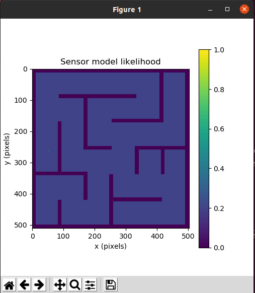

### Q6: Include your particle filter path plot for your 60-second simulated drive through CSE2.

Here is a plot of us driving the car in a straight line then turning left around the corner:

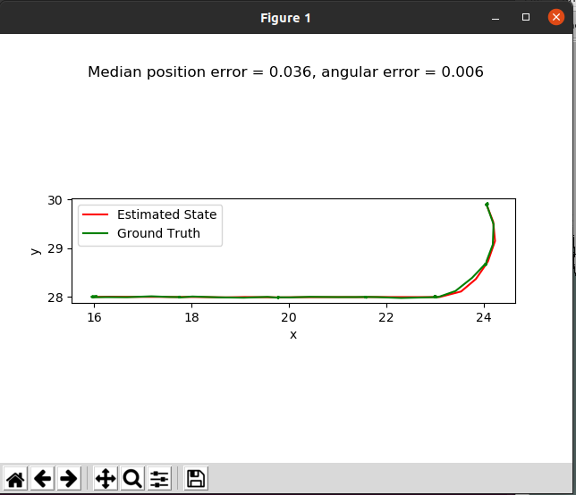

Now here is a plot of the car being driven more erratically and taking more turns within a 60 second period:

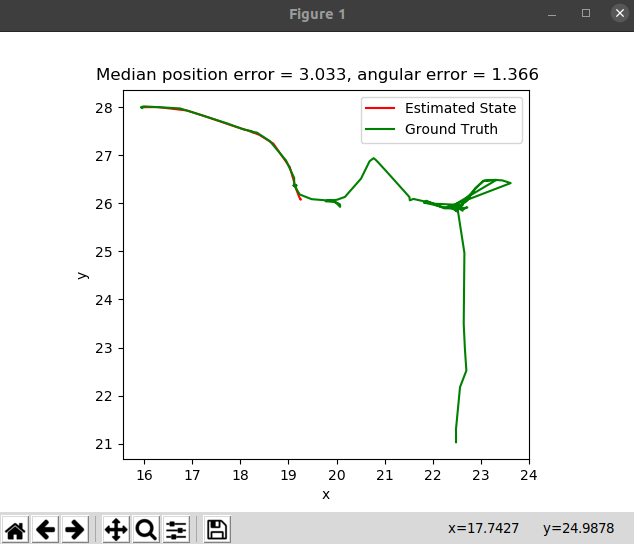

