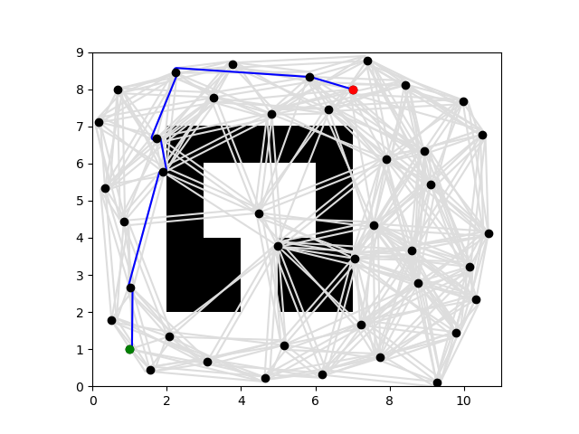

# Project 4: Planning [](../../../pipelines/submit-proj4/latest)

## Questions
### Q1: Include the A* shortest path figure on map2.txt between (252, 115) and (350, 350), with 600 vertices and a connection radius of 100.
```
Lazy: False
Vertices: 600
Edges: 19907
Running A*
Path length: 362.88692665140957
Planning time: 2.1533236503601074
Edges evaluated: 23016
```


### Q2: Holding the number of vertices constant at 600, vary the connection radius when computing the shortest path on map2.txt. For each experiment, report the radius, path length, and planning time. Explain any variation. (You may find a table useful for summarizing your findings.)

#### Summary: Explain the variation
#### Path Length:
As the connection radius changes, the path length generally stays relatively consistent once the radius is large enough to find a solution. For instance, for the radius of 80, 65, 61, and 200, the path length remains around 362-363 units, showing that the connection radius does not significantly impact the shortest path found once a solution is feasible.

#### Planning Time:
The planning time is heavily impacted by the connection radius. A larger radius (eg. 200) results in a significant increase in the number of edges, leading to much longer planning times. In contrast, a smaller radius (eg. 61) leads to reduced planning time because fewer edges are evaluated. This suggests a trade-off between finding a connected graph and minimizing computational resources. 

#### Edges Evaluated:
The number of edges evaluated during the planning process increases with a larger connection radius. A higher radius creates more edges in the roadmap, providing more potential paths but at the cost of greater computational complexity. For instance, with a radius of 200, over 51000 edges are generated and over 73000 edges evaluated, compared to significantly fewer edges evaluated with smaller radius.

#### Failure Point
The planner fails to find a solution at a radius of 60, indicating that the roadmap connectivity becomes insufficient at this radius. This demonstrates the importance of choosing an appropriate connection radius to ensure graph connectivity while balancing computational efficiency.

Smaller radius tend to improve planning time due to reduced graph complexity but risk losing graph  connectivity and therefore the ability to find a solution. Larger radius increase the chance of finding an optimal path by creating more edges but result in significantly higher planning times. An optimal radius strikes a balance between ensuring sufficient connectivity and minimizing computational resources. For this particular case, a radius between 61 and 100 seems appropriate for efficient and successful pathfinding.

#### radius = 80
```
Lazy: False
Vertices: 600
Edges: 13880
Running A*
Path length: 362.9078053764987
Planning time: 1.4567821025848389
Edges evaluated: 15241
```


#### radius = 65
```
Lazy: False
Vertices: 600
Edges: 9828
Running A*
Path length: 363.068415217045
Planning time: 1.0152523517608643
Edges evaluated: 10458
```


#### radius = 61
```
Lazy: False
Vertices: 600
Edges: 8742
Running A*
Path length: 363.068415217045
Planning time: 0.8732738494873047
Edges evaluated: 9231
```


#### radius = 60
```
Lazy: False
Vertices: 600
Edges: 8528
Running A*
Node 601 not reachable from 600
```

#### radius = 200
```
Lazy: False
Vertices: 600
Edges: 51116
Running A*
Path length: 362.88669499958723
Planning time: 9.04147720336914
Edges evaluated: 73204
```


### Q3: Holding the connection radius constant at 100, vary the number of vertices when computing the shortest path on map2.txt. For each experiment, report the number of vertices, path length, and planning time. Explain any variation. (You may find a table useful for summarizing your findings.)

#### Summary: Explain the variation
#### Path Length
When increasing the number of vertices, the path length tends to decrease slightly. For instance, with 1200 vertices, the path length decreases to 356.33 units compared to 362.89 units when fewer vertices are used. This is because a larger number of vertices increases the probability of finding more direct connections between the start and goal, resulting in shorter paths.

#### Planning Time
The planning time increases significantly with the number of vertices. When the number of vertices is 550 or 541, the planning time is around 1.79 - 1.86 seconds, whereas with 1200 vertices, the planning time increases to 9.31 seconds. This is due to the increase in graph complexity, which requires evaluating a larger number of nodes and edges, resulting in a longer computation time.

#### Edges Evaluated
The number of edges evaluated is proportional to the number of vertices in the graph. With 1200 vertices, the number of edges evaluated is significantly higher (92, 124) compared to when there are 550 or 541 vertices (19181 and 18559 respectively). A larger graph has more possible connections to evaluate, which increases the computational burden. 

#### Failure Point
When the number of vertices is decreased to 540, the planner fails to find a solution, indicating that the number of nodes becomes insufficient to create a connected graph, especially in a complex environment. This highlights the importance of having an adequate number of vertices to ensure connectivity and path feasibility.

Increasing the number of vertices improves the path quality by reducing the path length, but at the cost significantly increased planning time and computational effort. There is a trade-off between the number of vertices and computational efficiency. A larger number of vertices ensures better connectivity and shorter paths but increases the complexity of the planning algorithm. An optimal number of vertices should strike a balance between maintaining graph connectivity and minimizing planning time. For this case, around 550 vertices seem to provide a reasonable balance between planning efficiency and solution feasibility.

#### vertices = 550
```
Lazy: False
Vertices: 550
Edges: 16605
Running A*
Path length: 362.88692665140957
Planning time: 1.8601510524749756
Edges evaluated: 19181
```


#### vertices = 541
```
2 -s 252 115 -g 350 350
Lazy: False
Vertices: 541
Edges: 16038
Running A*
Path length: 362.88692665140957
Planning time: 1.791741132736206
Edges evaluated: 18559
```


#### vertices = 540
```
Lazy: False
Vertices: 540
Edges: 16014
Running A*
Node 541 not reachable from 540
```

#### vertices = 1200
```
Lazy: False
Vertices: 1200
Edges: 80150
Running A*
Path length: 356.3329847638013
Planning time: 9.306385278701782
Edges evaluated: 92124
```


### Q4: Use the previous experiments to choose a number of vertices and connection radius for map2.txt. Compute the shortest path with A* and Lazy A*. Report the path length, planning time, and edges evaluated. Explain any variation.

#### Explain the variation
Based on the previous experiments, since a smaller radius tend to improve planning time and a balancing vertices number tend to strike a balance between maintaining graph connectivity and minimizing planning time, we choose 541 as number of vertices and 61 as connection radius to compute the shortest path with A* and lazy A*. According to the output data and figures, we can find that there si no particularly significant change in path length, but the planning time and edges valuated has significant reduction. 

Comparing A* with Lazy A*, A* guarantees finding the shortest path from the start to the goal, so it needs more time to explore and compute. Lazy A* avoids unnecessary exploration of the graph and evaluates fewer edges than A* because it delays exploration until necessary. Therefore Lazy A* has faster planning time and fewer evaluated edges.


```
vertices = 541
radius = 61
```

#### A*
```
Lazy: False
Vertices: 543
Edges: 7126
Running A*
Path length: 363.068415217045
Planning time: 0.7403872013092041
Edges evaluated: 7470
```


#### Lazy A*
```
Lazy: True
Vertices: 543
Edges: 7470
Running A*
Path length: 363.068415217045
Planning time: 0.11928772926330566
Edges evaluated: 176
```


### Q5: Compare the time spent on planning and shortcutting on map1.txt. Describe qualitatively how the paths differ.
```
Lazy: True
Vertices: 25
Edges: 51
Running A*
Path length: 12.960450156532826
Planning time: 0.0038709640502929688
Edges evaluated: 14
Shortcutting A* path
Shortcut length: 12.591492106547538
Shortcut time: 0.019388675689697266
```
#### Time Comparison
The planning time for running A* on map1.txt is very fast, taking only about 0.00387 seconds. This is due to the relatively small number of vertices (25) and edges (51), which keeps the search space simple. The shortcutting process, on the other hand, takes about 0.019389 seconds, which is longer than the original planning time. This is because the shortcutting algorithm attempts to find more direct routes between existing path nodes, requiring additional collision checks and distance calculations. Even though shortcutting takes longer than the initial A* planning step, the time spent is relatively small.
#### Path Difference
The original path has a length of 12.96 units. The algorithm finds the shortest path available on the given graph based on the vertices and edges. After shortcutting, the path length is reduced to 12.59 units. This reduction indicates that the shortcutting step found ways to remove unnecessary intermediate nodes and replaced segments with direct connections that were collision-free. Shortcutting effectively attempts to smooth out the path by reducing the number of segments, resulting in a shorter and more direct route. 

While shortcutting takes slightly longer than the initial planning step, it leads to a more optimal path, with fewer nodes and a shorter overall length. The trade-off here is additional computational time for a more  efficient and practical path, especially important for real-world applications like robotics where smooth paths are preferred for easier navigation. 

### Q6: Holding the number of vertices and connection radius constant at 40 and 4 respectively, vary the curvature at 3, 4.5, 9, and 15 when computing the shortest path on map1.txt. Include plots of the computed paths for each curvature. Describe qualitatively how the paths differ, and quantitatively compare the path lengths.

#### Summary: Describe & Compare
#### When Curvature = 3
The path is less direct, consisting of more turns and deviations compared to the higher curvatures. The car takes longer turns, which results in a path with more unnecessary detours. The increased path length is primarily due to the tighter constraints on curvature, forcing the planner to take wider arcs.

#### When Curvature = 4.5
The path becomes more direct compared to a curvature of 3, reducing the number of unnecessary deviations. The car is able to take sharper turns, which results in a more optimized path. As the curvature limit increases, the flexibility of the path improves, resulting in a shorter distance.

#### When Curvature = 9
The path becomes noticeably shorter, indicating that the car is able to make even sharper turns and follow a more direct route to the target. The path also appears smoother, with fewer intermediate nodes, and makes better use of available free space. 

#### When Curvature = 15
This is the shortest path among all the curvature tested, indicating that the high curvature allows the car to take very tight turns. The path has a more straightforward trajectory, and the car can follow the shortest possible distance between start and goal, taking advantage of all possible direct routes. 

For comparisons, as the curvature increases, the path length decreases. This is because a higher curvature allows for tighter turns, enabling the car to take more direct routes, reducing the overall distance. So that increasing the curvature improves the efficiency of the path by reducing the path length, which is beneficial in minimizing travel time and energy consumption. However, allowing a very high curvature could be physically challenging depending on the car's turning capabilities, so there is a practical trade-off between achieving shorter paths and the mechanical limits of the robot. 

#### curvature = 3
```
Lazy: True
Vertices: 40
Edges: 332
Running A*
Path length: 16.086911525242698
Planning time: 0.09262323379516602
Edges evaluated: 38
```


#### curvature = 4.5
```
Lazy: True
Vertices: 40
Edges: 381
Running A*
Path length: 14.77307984701639
Planning time: 0.10407018661499023
Edges evaluated: 40
```


#### curvature = 9
```
Lazy: True
Vertices: 40
Edges: 418
Running A*
Path length: 13.606245510056146
Planning time: 0.10809874534606934
Edges evaluated: 35
```


#### curvature = 15
```
Lazy: True
Vertices: 40
Edges: 431
Running A*
Path length: 13.20596227969313
Planning time: 0.1049506664276123
Edges evaluated: 33
```


### Q7: The minimum and maximum steering angles used by MPC are -0.34 and 0.34 radians respectively. Knowing that the distance between the axles is 0.33 meters, what is the maximum curvature for the MuSHR car? (Hint: think about the kinematic car model.)
According to the kinematic car model, we know that `R = L / tan(δ)` and `κ = 1 / R`, so `κ = tan(δ) / L`. Since we want to know the maximum curvature for MuSHR car, as L is fixed which is 0.33, we want δ bigger, so we set δ as 0.34 radians.

`κ = tan(δ) / L = tan(0.34) / 0.33 = 0.3537 / 0.33 = 1.07`

As a result, the maximum curvature for the MuSHR car is 1.07 m^-1.

### Q8: Include an RViz screenshot of the MuSHR car tracking a path in maze 0, as well as the parameters you used to construct the roadmap.

```
 motion_params:
   vel_std:    0.01
   delta_std:  0.1
   x_std:      0.01
   y_std:      0.008
   theta_std:  0.01

 sensor_params:
   hit_std:    0.7
   z_hit:      0.6
   z_short:    0.02
   z_max:      0.01
   z_rand:     0.1
```


### Q9: Include an RViz screenshot of the MuSHR car tracking a path in small basement, as well as the parameters you used to construct the roadmap.


```
 motion_params:
   vel_std:    0.01
   delta_std:  0.1
   x_std:      0.01
   y_std:      0.008
   theta_std:  0.01

 sensor_params:
   hit_std:    0.7
   z_hit:      0.6
   z_short:    0.02
   z_max:      0.01
   z_rand:     0.1
```


### Q10: If you retuned either the particle filter or MPC, describe why you thought it was necessary and how you chose the new parameters.


### Q11: Demo: Run the planner with a controller of your choice and particle filter in real life. Submit a video of the car.
https://drive.google.com/file/d/1ly8ZI3aKvOAeWuMcNrVvMmDxn_ns5CMa/view?usp=sharing

### Extra Credits Q5.1: Compute the path for the SEProblem on map1.txt between (1, 1, 0°) and (7, 8, 45°) with curvature 3. Include the figure in your writeup.
```
Running RRT
Bias: 0.05
Eta: 0.5
Max iterations: 1000
Path length: 21.179529747185818
Planning time: 0.15369248390197754
Edges evaluated: 37
```


### Extra Credits Q5.2: Parameter η defines how far the tree expands to the sampled nodes. Additionally, the goal node can be sampled with probability bias. For this exercise we start with η = 0.5 and bias = 0.05. Try running RRT for different parameter values and provide an intuition on how those parameters affect the convergence and the solution. If no solution is found, the algorithm returns an empty array. Try to increase max iter and be more conservative when tuning the parameters.

#### ALL FIGURES ARE ATTACHED TO THE images Files
#### Change Eta
Keep bias and max_iteration constant, a larger η makes the tree to expand more rapidly, provides less planning time. However, large steps may cause the tree to overshoot, resulting in inefficient exploration or missing the optimal path. When the η become too large, it might lead to a failure in finding the path. A smaller η makes it more controlled and finer exploration, which may result in a more thorough search of the environment. However, if the η become too small, it requires more iterations to cover the space and might slow down the algorithm's progress toward the goal.

```
Running RRT
Bias: 0.05
Eta: 0.3
Max iterations: 1000
Path length: 9.511729689995462
Planning time: 0.6715185642242432
Edges evaluated: 87
```

```
Running RRT
Bias: 0.05
Eta: 0.4
Max iterations: 1000
Path length: 4.509901561116775
Planning time: 0.8080182075500488
Edges evaluated: 87
```

```
Running RRT
Bias: 0.05
Eta: 0.6
Max iterations: 1000
Path length: 20.519186876476898
Planning time: 0.22078895568847656
Edges evaluated: 37
```

```
Running RRT
Bias: 0.05
Eta: 0.7
Max iterations: 1000
Path length: 19.933950498333584
Planning time: 0.21561574935913086
Edges evaluated: 37
```

```
Running RRT
Bias: 0.05
Eta: 0.8
Max iterations: 1000
Path length: 21.893974847867494
Planning time: 0.20109844207763672
Edges evaluated: 37
```

```
Running RRT
Bias: 0.05
Eta: 0.9
Max iterations: 1000
Path length: 12.188286304403224
Planning time: 0.8738970756530762
Edges evaluated: 80
```

```
Running RRT
Bias: 0.05
Eta: 1.0
Max iterations: 1000
Path length: 17.67449878123554
Planning time: 0.06453585624694824
Edges evaluated: 17
```

#### Change Bias
Keep η and max_iteration constant, a larger bias will increase the likelihood of sampling near the goal, improving the speed reaching it or finding a feasible path. However, this may cause less exploration of the entire space, resulting in suboptimal paths if the space is complex. A smaller bias makes more uniform exploration of the space, reducing the chance of getting stuck near local solutions. However, when it become too small, it may slow down the convergence to the goal because the algorithm will sample more randomly.

```
Running RRT
Bias: 0.01
Eta: 0.5
Max iterations: 1000
Path length: 27.573497738369124
Planning time: 1.4058189392089844
Edges evaluated: 114
```

```
Running RRT
Bias: 0.02
Eta: 0.5
Max iterations: 1000
Path length: 21.179529747185818
Planning time: 0.15878844261169434
Edges evaluated: 36
```

```
Running RRT
Bias: 0.03
Eta: 0.5
Max iterations: 1000
Path length: 21.179529747185818
Planning time: 0.15421485900878906
Edges evaluated: 37
```

```
Running RRT
Bias: 0.04
Eta: 0.5
Max iterations: 1000
Path length: 21.179529747185818
Planning time: 0.15677499771118164
Edges evaluated: 37
```

```
Running RRT
Bias: 0.06
Eta: 0.5
Max iterations: 1000
Path length: 21.179529747185818
Planning time: 0.15744924545288086
Edges evaluated: 37
```

```
Running RRT
Bias: 0.07
Eta: 0.5
Max iterations: 1000
Path length: 21.179529747185818
Planning time: 0.1548936367034912
Edges evaluated: 37
```

```
Running RRT
Bias: 0.08
Eta: 0.5
Max iterations: 1000
Path length: 21.179529747185818
Planning time: 0.1542658805847168
Edges evaluated: 38
```

```
Running RRT
Bias: 0.09
Eta: 0.5
Max iterations: 1000
Path length: 21.179529747185818
Planning time: 0.16136789321899414
Edges evaluated: 39
```

```
Running RRT
Bias: 0.1
Eta: 0.5
Max iterations: 1000
Path length: 21.179529747185818
Planning time: 0.1613762378692627
Edges evaluated: 39
```

``` 
Running RRT
Bias: 0.15
Eta: 0.5
Max iterations: 1000
Path length: 25.604374353863978
Planning time: 0.178786039352417
Edges evaluated: 41
```

#### Change Max Iterations
Keep η and bias constant, increasing the maximum iteration, it allows more time for the tree to expand and improves the chances of finding a solution. If the algorithm fails to find a path within the current iteration limit, try to increase max iter may find the path again.

```
Running RRT
Bias: 0.05
Eta: 0.5
Max iterations: 1200
Path length: 21.179529747185818
Planning time: 0.15900421142578125
Edges evaluated: 37
```

```
Running RRT
Bias: 0.05
Eta: 0.5
Max iterations: 1500
Path length: 21.179529747185818
Planning time: 0.15633726119995117
Edges evaluated: 37
```

```
Running RRT
Bias: 0.05
Eta: 0.5
Max iterations: 2000
Path length: 21.179529747185818
Planning time: 0.15499567985534668
Edges evaluated: 37
```

```
Running RRT
Bias: 0.05
Eta: 0.5
Max iterations: 3000
Path length: 21.179529747185818
Planning time: 0.1536850929260254
Edges evaluated: 37
```
